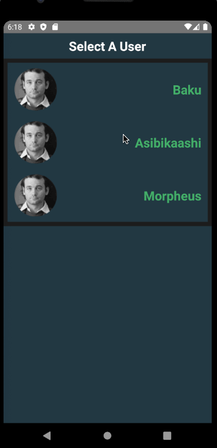

# Sleep Data Visualization Demonstration

[](https://circleci.com/gh/infinitered/ignite-bowser)

## Technologies Used

This project was started with Ignite from Infinite Red as it provides generators to rapidly build and hook up components, screens, and more. It also provides some solid practices around project organization and optimizations for quicker debugging.

Currently includes (from [Infinite Red](https://github.com/infinitered/ignite-bowser#about-the-stack) boilerplate):

- React Native
- React Navigation
- MobX State Tree
- TypeScript
- and more!

### Additonal Libraries

- [react-native-svg-charts](https://github.com/JesperLekland/react-native-svg-charts) - for simple visualizations
- [date-fns](https://date-fns.org/) - for date formatting and parsing

## Quick Start

Demonstration:


### Launching Dev

This project is currently _not_ configured for production builds of the application. As such you will need to follow a few steps to get up and running:

1. set up your development environment via the [React Native docs](https://reactnative.dev/docs/environment-setup).
2. install [yarn](https://yarnpkg.com/getting-started/install).
3. set up a [simulator/emulator](https://developer.android.com/studio/run/managing-avds.html) or on [device](https://reactnative.dev/docs/running-on-device)
4. install dependencies: `yarn install`
5. launch the application: `yarn android` or `yarn ios`

If you want to see more about the inner workings, this is hooked up with [Reactotron](https://github.com/infinitered/reactotron) in which you can explore some of the logging and state management.

## For Reference

Some things to note in this project:

- sleep stages are mapped such (they currently lack labels):
  - out = bright orange (1)
  - awake = orange (0)
  - light = green (-1)
  - deep = blue (-2)

## Reflections

The core of the application works and demonstrates competency, however, there are certainly some things I'd love to do to it that I deprioritized due to time constraints:

- clean up date formatting for stages
- fix the scrollview for session visuals
- add decorators with the timeseries data
- add labels for the stages (start time, finish time are already there)
- add axis labels for stages (stages with colors for the y-axis and time window for the x-axis)
- add session length visually

Time spent on project: 12 hrs (includes research, design, and environment issues)

## Exploring the Project

The Ignite Bowser boilerplate project's structure will look similar to this:

```
ignite-project
├── app
│   ├── components
│   ├── i18n
│   ├── utils
│   ├── models
│   ├── navigation
│   ├── screens
│   ├── services
│   ├── theme
│   ├── app.tsx
├── storybook
│   ├── views
│   ├── index.ts
│   ├── storybook-registry.ts
│   ├── storybook.ts
├── test
│   ├── __snapshots__
│   ├── storyshots.test.ts.snap
│   ├── mock-i18n.ts
│   ├── mock-reactotron.ts
│   ├── setup.ts
│   ├── storyshots.test.ts
├── README.md
├── android
│   ├── app
│   ├── build.gradle
│   ├── gradle
│   ├── gradle.properties
│   ├── gradlew
│   ├── gradlew.bat
│   ├── keystores
│   └── settings.gradle
├── ignite
│   ├── ignite.json
│   └── plugins
├── index.js
├── ios
│   ├── IgniteProject
│   ├── IgniteProject-tvOS
│   ├── IgniteProject-tvOSTests
│   ├── IgniteProject.xcodeproj
│   └── IgniteProjectTests
├── .env
└── package.json

```

### ./app directory

Included in an Ignite boilerplate project is the `app` directory. This is a directory you would normally have to create when using vanilla React Native.

The inside of the src directory looks similar to the following:

```
app
│── components
│── i18n
├── models
├── navigation
├── screens
├── services
├── theme
├── utils
└── app.tsx
```

**components**
This is where your React components will live. Each component will have a directory containing the `.tsx` file, along with a story file, and optionally `.presets`, and `.props` files for larger components. The app will come with some commonly used components like Button.

**i18n**
This is where your translations will live if you are using `react-native-i18n`.

**models**
This is where your app's models will live. Each model has a directory which will contain the `mobx-state-tree` model file, test file, and any other supporting files like actions, types, etc.

**navigation**
This is where your `react-navigation` navigators will live.

**screens**
This is where your screen components will live. A screen is a React component which will take up the entire screen and be part of the navigation hierarchy. Each screen will have a directory containing the `.tsx` file, along with any assets or other helper files.

**services**
Any services that interface with the outside world will live here (think REST APIs, Push Notifications, etc.).

**theme**
Here lives the theme for your application, including spacing, colors, and typography.

**utils**
This is a great place to put miscellaneous helpers and utilities. Things like date helpers, formatters, etc. are often found here. However, it should only be used for things that are truely shared across your application. If a helper or utility is only used by a specific component or model, consider co-locating your helper with that component or model.

**app.tsx** This is the entry point to your app. This is where you will find the main App component which renders the rest of the application. This is also where you will specify whether you want to run the app in storybook mode.

### ./ignite directory

The `ignite` directory stores all things Ignite, including CLI and boilerplate items. Here you will find generators, plugins and examples to help you get started with React Native.

### ./storybook directory

This is where your stories will be registered and where the Storybook configs will live

### ./test directory

This directory will hold your Jest configs and mocks, as well as your [storyshots](https://github.com/storybooks/storybook/tree/master/addons/storyshots) test file. This is a file that contains the snapshots of all your component storybooks.

## Running Storybook

From the command line in your generated app's root directory, enter `yarn run storybook`
This starts up the storybook server.

In `index.js`, change `SHOW_STORYBOOK` to `true` and reload the app.
For Visual Studio Code users, there is a handy extension that makes it easy to load Storybook use cases into a running emulator via tapping on items in the editor sidebar. Install the `React Native Storybook` extension by `Orta`, hit `cmd + shift + P` and select "Reconnect Storybook to VSCode". Expand the STORYBOOK section in the sidebar to see all use cases for components that have `.story.tsx` files in their directories.
